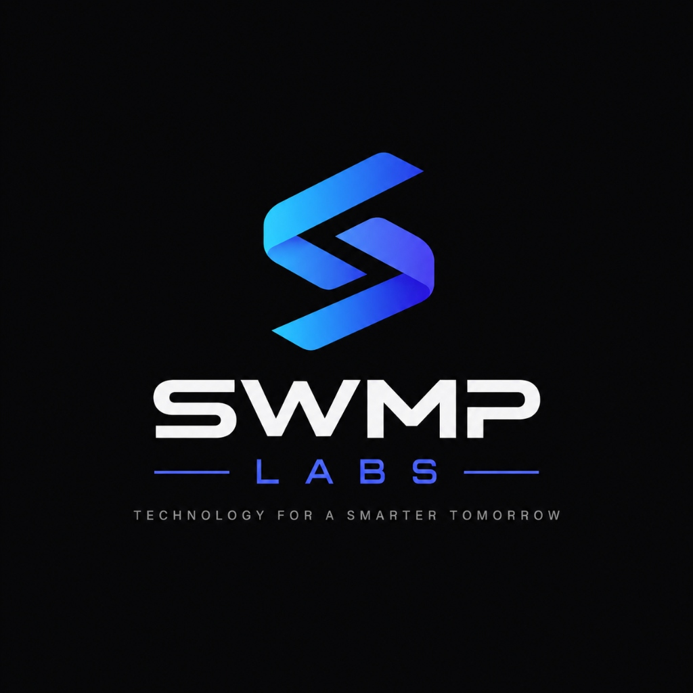

<div align="center">
  
  

  # Axiom Research AI: Next-Gen Academic Systems Literature Engine
  *An open-source initiative by **SWMP Labs** — Technology for a Smarter Tomorrow*
</div>

A production-grade, asynchronous Academic Research Assistant built with **FastAPI**, **concurrent API fetching** (ArXiv & Semantic Scholar), **on-demand OrcaRouter/DeepSeek LLM synthesis**, and a responsive single-page web interface (**Tailwind CSS + Marked.js**). Engineered under the **SWMP Labs Core Research Suite**.

---

## Key Features

1. **Concurrent Academic Fetching (`httpx.AsyncClient` & `asyncio.gather`)**:
   - Simultaneously queries the **ArXiv API** (filtered to CS categories `cs.DC`, `cs.SE`, `cs.AI`, `cs.AR`) and **Semantic Scholar API**.
   - If `SEMANTIC_SCHOLAR_API_KEY` is provided, passes `{"x-api-key": ...}` for elevated rate limits; otherwise falls back gracefully to public unauthenticated access.
   - Handles network timeouts and rate limits (HTTP 429) gracefully without aborting the research pipeline.
   - Extracts paper titles, author rosters, publication years, abstracts, TLDRs, citation counts, and direct Open Access PDF hyperlinks.
   - Intelligent deduplication engine using normalized title similarity (`difflib.SequenceMatcher >= 0.85`), recency ranking, and top-6 curation.

2. **LLM Synthesis & Reasoning (OrcaRouter & DeepSeek)**:
   - Uses the official `openai.AsyncOpenAI` SDK configured for OrcaRouter (`https://orcarouter.com/v1`, model `deepseek/deepseek-v4-flash-free`).
   - Acts as an expert Senior Distributed Systems & Academic Computing Researcher.
   - Strict 4-point paper breakdown:
     1. Core Problem Statement
     2. Technical Infrastructure / Methodology
     3. Future Work / Research Gaps
     4. Direct Markdown hyperlink to paper or PDF
   - Dedicated Section: **"Suggested Research Extensions (Delta Improvements)"** proposing concrete, benchmarkable thesis ideas.
   - Streaming token generator via Server-Sent Events (SSE).
   - Built-in heuristic offline synthesis mode if an API key is not yet configured, allowing immediate local testing.

3. **Modern, Responsive Frontend (Tailwind CSS + HTML5)**:
   - **Axiom Geometric Monograph Brand Identity & SWMP Labs Credit Line**: Custom SVG badges, header mark, and parent lab footer.
   - **Real-Time Pipeline Stages**: Live progress tracker reflecting:
     - *Extracting Academic Keywords*
     - *Fetching ArXiv (cs.DC, cs.SE, cs.AI, cs.AR)*
     - *Querying Semantic Scholar*
     - *Deduplicating & Ranking Papers*
     - *Synthesizing with DeepSeek*
   - **Discovered Papers Side Drawer**:
     - Badges for publication year, citation count, and repository source.
     - Direct `[PDF Access]` action button.
     - "Copy Citation" button for quick referencing.
   - **Markdown Synthesis Feed**:
     - Fast client-side rendering via `marked.js` with `dompurify`.
     - One-click "Copy Markdown" and "Export .md" buttons.
   - **In-Browser Dual API Key Configuration**:
     - Configure both `ORCAROUTER_API_KEY` and optional `SEMANTIC_SCHOLAR_API_KEY` directly from the UI modal without restarting the server.

---

## Project Structure

```
academic-research-assistant/
├── main.py                     # FastAPI application, routes, and SSE streaming pipeline
├── services/
│   ├── __init__.py             # Service exports
│   ├── search.py               # ArXiv & Semantic Scholar async clients, deduplication
│   └── llm.py                  # OrcaRouter OpenAI-compatible client, streaming synthesis
├── templates/
│   └── index.html              # Responsive Tailwind CSS single-page interface
├── static/                     # Static assets directory
├── .env                        # Active environment configuration
├── .env.example                # Example environment variables
├── requirements.txt            # Python dependencies
└── .gitignore                  # Git ignore rules (.env, __pycache__)
```

---

## Quickstart Guide

### 1. Install Dependencies

```bash
pip install -r requirements.txt
```

### 2. Configure Environment (`.env`)

Copy `.env.example` to `.env`:

```bash
cp .env.example .env
```

Edit `.env` and supply your credentials:

```env
ORCAROUTER_API_KEY=your_orcarouter_api_key_here
ORCAROUTER_BASE_URL=https://orcarouter.com/v1
MODEL_NAME=deepseek/deepseek-v4-flash-free

# Server Configuration
HOST=127.0.0.1
PORT=8000
```

> **Note**: You can also enter or update your API keys directly in the web UI via the **"API Keys"** button in the header.

### 3. Launch the Server

```bash
uvicorn main:app --host 127.0.0.1 --port 8000 --reload
```

Open your browser and navigate to:
**`http://127.0.0.1:8000`**

---

## API Endpoints

- `GET /`: Serves the responsive SPA web application.
- `GET /health`: JSON system health check and configuration status.
- `GET /api/research/stream?query=...`: Real-time Server-Sent Events (SSE) streaming pipeline.
- `POST /api/search`: Non-streaming endpoint returning parsed, deduplicated papers.
- `POST /api/synthesize`: Non-streaming academic synthesis endpoint.
- `POST /api/config`: Updates runtime API keys and settings in memory.
